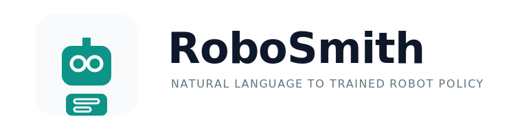

<p align="center">
  
</p>

<p align="center">
  <a href="https://www.python.org/downloads/"></a>
  <a href="https://opensource.org/licenses/MIT"></a>
  <a href="https://shaswat2001.github.io/robosmith/"></a>
</p>

---

RoboSmith is an agentic robotics toolchain for turning task descriptions into
trained policies. It also helps connect the
policies, datasets, environments, and rollouts that robotics teams already have.

It has two modes of operation.

**Train from scratch** — describe a task in plain English, get a trained RL policy:

```bash
robosmith run --task "A Franka arm that picks up a red cube"
```

**Integrate existing work** — inspect policies and datasets, find mismatches, generate adapter code:

```bash
robosmith inspect compat lerobot/smolvla_base lerobot/aloha_mobile_cabinet --fix
```

Both modes are built on the same agentic foundation: LangGraph state machines where every step is an explicit node, failures are routed and retried automatically, and the full pipeline state is persisted to disk after every node so nothing is lost.

---

## Why two modes?

The original vision for RoboSmith was purely about training from scratch — describe a task, get a policy. That pipeline still exists and works well. But in practice, robotics teams spend as much time *integrating* existing work as they do training new things. You find a policy on HuggingFace that's close to what you need, but it was trained on a dataset with different camera names, a different action dimension, or images at the wrong resolution. Before you can evaluate or fine-tune it, you need to understand exactly what the mismatch is and how to fix it.

The `inspect`, `diag`, `gen`, and `auto` commands address this directly. They're not add-ons — they're a natural extension of the same mission: remove friction from robot policy development.

---

## Installation

```bash
git clone https://github.com/Shaswat2001/robosmith.git
cd robosmith
pip install -e ".[sim,train,agent]"
```

Install extras based on what you need:

```bash
pip install -e ".[sim]"       # MuJoCo + Gymnasium
pip install -e ".[train]"     # Stable Baselines3 + PyTorch
pip install -e ".[agent]"     # LangGraph (required for run and auto)
pip install -e ".[robotics]"  # Gymnasium-Robotics (Fetch, Shadow Hand)
pip install -e ".[video]"     # Video recording
pip install -e ".[all]"       # Everything
```

Check what's installed and what's missing:

```bash
robosmith deps
```

## API Keys

RoboSmith reads `.env.local` on startup and auto-detects the LLM provider from whichever key is present. Create `.env.local` in your project directory:

```bash
ANTHROPIC_API_KEY=sk-ant-...      # Anthropic (Claude) — recommended
OPENAI_API_KEY=sk-...             # OpenAI
GEMINI_API_KEY=AIza...            # Google Gemini
GROQ_API_KEY=gsk_...              # Groq (fast + generous free tier)
OPENROUTER_API_KEY=sk-or-...      # OpenRouter (multi-provider gateway)
S2_API_KEY=...                    # Optional: higher Semantic Scholar rate limit
```

Provider auto-detection priority: Anthropic → OpenAI → Gemini → Groq → OpenRouter.

The `inspect`, `diag`, and `gen --no-llm` commands work without any API key.

---

## Training Pipeline (`robosmith run`)

The pipeline runs as a compiled LangGraph `StateGraph`. Each stage is a node with typed inputs and outputs. Conditional edges handle failure routing — when evaluation fails, the graph routes back to reward design with a plain-English analysis of what went wrong, not a blank restart.

```
Natural language task
        │
        ▼
┌─────────────┐
│   Intake    │  LLM parses task → structured TaskSpec
└──────┬──────┘
       │
       ▼
┌─────────────┐
│    Scout    │  Literature search → reward design context
└──────┬──────┘
       │
       ▼
┌──────────────────┐
│  Env Synthesis   │  Tag-matching → best simulation environment
└──────┬───────────┘
       │
       ▼
┌──────────────────┐
│  Reward Design   │  Eureka-style: generate → evaluate → evolve
└──────┬───────────┘
       │
       ▼
┌──────────────────┐
│    Training      │  SB3 / CleanRL / rl_games — auto-selected
└──────┬───────────┘
       │
       ▼
┌──────────────────┐
│   Evaluation     │  Behavioral success + LLM decision agent
└──────┬───────────┘
       │
       ├── accept ─────────────────────────────┐
       │                                       │
       └── refine / switch_algo ──▶ [retry]    ▼
                                     ┌──────────────────┐
                                     │    Delivery      │  checkpoint + video + report
                                     └──────────────────┘
```

Up to 3 iterations by default. Each retry feeds the training curve analysis back into reward design so the LLM knows what went wrong.

### Quick examples

```bash
# Basic run — provider auto-detected from .env.local
robosmith run --task "Train a HalfCheetah to run as fast as possible"

# Choose your LLM
robosmith run --task "..." --llm openai
robosmith run --task "..." --llm gemini
robosmith run --task "..." --llm openai/gpt-4o-mini   # exact LiteLLM model string

# Choose the literature search backend
robosmith run --task "..." --scout arxiv              # recent preprints, no key needed
robosmith run --task "..." --scout both               # Semantic Scholar + ArXiv merged
robosmith run --task "..." --scout semantic_scholar   # default

# Control training
robosmith run --task "..." --algo ppo --time-budget 30
robosmith run --task "..." --backend cleanrl
robosmith run --task "..." --candidates 6

# Dry run — parse and plan only, no training
robosmith run --task "..." --dry-run

# Skip literature search (saves 10–60 seconds)
robosmith run --task "..." --skip scout

# Use a config file
robosmith run --task "..." --config robosmith.yaml
```

### What gets produced

Every run creates a timestamped directory in `robosmith_runs/`:

```
robosmith_runs/run_20260415_182058_a64796/
├── reward_function.py     # The evolved reward function (runnable Python)
├── policy_ppo.zip         # Trained model checkpoint
├── eval_report.json       # Success rate, mean reward, decision
├── policy_rollout.mp4     # Video of the trained policy
├── report.md              # Human-readable run summary
├── run_state.json         # Full pipeline state (for debugging)
└── task_spec.json         # Parsed task specification
```

### `robosmith run` flags

| Flag | Default | Description |
|------|---------|-------------|
| `--task` / `-t` | required | Natural language task description |
| `--llm` / `-L` | auto | Provider (`anthropic`, `openai`, `gemini`, `groq`) or full model string |
| `--scout` | `semantic_scholar` | Literature backend: `semantic_scholar`, `arxiv`, `both` |
| `--algo` / `-a` | `auto` | RL algorithm: `ppo`, `sac`, `td3` |
| `--time-budget` | `60` | Max training time in minutes |
| `--candidates` / `-c` | `4` | Reward candidates per generation |
| `--backend` / `-b` | auto | Training backend: `sb3`, `cleanrl` |
| `--robot` / `-r` | auto | Robot type: `arm`, `quadruped`, `biped`, `dexterous_hand`, `mobile_base` |
| `--num-envs` | `1024` | Parallel simulation environments |
| `--skip` / `-s` | — | Stages to skip: `scout`, `intake`, `delivery` |
| `--push-to-hub` | — | HuggingFace repo to push artifacts to |
| `--dry-run` | — | Parse and plan only, no training |
| `--verbose` / `-v` | — | Debug logs to `robosmith_runs/latest.log` |
| `--config` | — | Path to `robosmith.yaml` |

---

## Integration Tooling

### Why this exists

Not every robotics workflow starts from scratch. You might have a pre-trained policy from HuggingFace, a demonstration dataset collected on your robot, or an existing simulation environment — and the challenge isn't training but *connecting* these pieces. A policy trained on one dataset won't work out-of-the-box on another if the camera names, action dimensions, or image sizes differ.

The integration tooling gives you four primitives:

| Command | What it answers |
|---------|----------------|
| `inspect` | What exactly is this artifact? What are its dimensions, schemas, and interfaces? |
| `diag` | How did this policy actually perform in these rollouts? Where did it fail? |
| `gen` | Give me Python code that bridges these two mismatched artifacts |
| `auto` | Run inspect + gen end-to-end as a single agentic workflow |

### `robosmith inspect`

Inspect any robotics artifact and understand its structure before using it.

```bash
# Dataset — cameras, action/state dims, episodes, tasks, storage format
robosmith inspect dataset lerobot/aloha_mobile_cabinet
robosmith inspect dataset lerobot/aloha_mobile_cabinet --schema   # column-level stats
robosmith inspect dataset lerobot/aloha_mobile_cabinet --quality  # NaN and constant-column checks
robosmith inspect dataset lerobot/aloha_mobile_cabinet --json

# Simulation environment — obs/action spaces, episode structure, render modes
robosmith inspect env Ant-v5
robosmith inspect env Ant-v5 --obs-docs   # per-dimension descriptions
robosmith inspect env Ant-v5 --sample     # run one step, dump actual obs/reward/info

# Policy — architecture, expected inputs/outputs, action head
robosmith inspect policy lerobot/smolvla_base
robosmith inspect policy lerobot/smolvla_base --config       # full training config
robosmith inspect policy lerobot/smolvla_base --requirements # package requirements

# Robot description file (URDF or MJCF)
robosmith inspect robot path/to/robot.urdf

# Compatibility check — finds mismatches between any two artifacts
robosmith inspect compat lerobot/smolvla_base lerobot/aloha_mobile_cabinet
robosmith inspect compat lerobot/smolvla_base lerobot/aloha_mobile_cabinet --fix
```

The `--fix` flag generates a `PolicyAdapter` class that resolves all detected mismatches — camera key remapping, action dimension adaptation, image resizing. No API key required.

### `robosmith diag`

Analyze trajectory rollouts to understand policy performance beyond just reward numbers.

```bash
# Single trajectory — success rate, episode lengths, action stats, failure clusters
robosmith diag trajectory path/to/rollout.hdf5
robosmith diag trajectory lerobot/aloha_mobile_cabinet   # Hub repo_id also works
robosmith diag trajectory path/to/rollout.hdf5 --json

# Side-by-side comparison — what changed between two rollouts?
robosmith diag compare rollout_a.hdf5 rollout_b.hdf5
robosmith diag compare rollout_a.hdf5 rollout_b.hdf5 --json
```

### `robosmith gen`

Generate Python adapter code to bridge mismatches between a policy and a target.

```bash
# Uses LLM by default for smarter, context-aware code
robosmith gen wrapper lerobot/smolvla_base lerobot/aloha_mobile_cabinet

# Template-based generation — no API key needed
robosmith gen wrapper lerobot/smolvla_base lerobot/aloha_mobile_cabinet --no-llm

# Write to file
robosmith gen wrapper lerobot/smolvla_base lerobot/aloha_mobile_cabinet -o adapter.py
```

### `robosmith auto`

Run the full integration workflow — inspect both artifacts, check compatibility, generate adapter — as a single agentic pipeline.

```bash
robosmith auto integrate lerobot/smolvla_base lerobot/aloha_mobile_cabinet
robosmith auto integrate lerobot/smolvla_base lerobot/aloha_mobile_cabinet --verbose
robosmith auto integrate lerobot/smolvla_base lerobot/aloha_mobile_cabinet -o adapter.py
```

### `robosmith envs`

Browse and filter the 30 pre-registered simulation environments. All filters use case-insensitive substring matching.

```bash
robosmith envs                        # all environments
robosmith envs --framework gym        # matches "gymnasium"
robosmith envs --framework isaac      # matches "isaac_lab"
robosmith envs --robot arm
robosmith envs --env-type tabletop
robosmith envs --tags "pick place"
robosmith envs --framework bogus      # clear error + available options listed
```

---

## Architecture

### LangGraph state machines

Every workflow in RoboSmith runs as a compiled LangGraph `StateGraph`. Each stage is a **node** with typed inputs and outputs. Conditional **edges** handle routing: failures go to recovery, evaluation failures go back to reward design with feedback. The full `PipelineState` is written to disk after every node.

This architecture makes the system transparent and debuggable. You can inspect `run_state.json` after any run to see exactly what every node received and produced. You can resume a failed run from the last successful node. And the conditional routing means the system adapts to failures intelligently rather than failing with a traceback.

### Training backends

| Backend | Algorithms | When it's used |
|---------|-----------|----------------|
| **SB3** (default) | PPO, SAC, TD3, A2C, DQN | Most tasks |
| **CleanRL** | PPO | Pure PyTorch, no SB3 dependency |
| **rl_games** | PPO | GPU-parallel Isaac Lab training |
| **IL** | BC, DAgger | Tasks with demonstration data |
| **Offline RL** | TD3+BC, CQL, IQL | Tasks with static datasets |

### LLM providers

RoboSmith uses [LiteLLM](https://litellm.ai/) for all LLM calls.

| Provider | Key | Models used |
|----------|-----|-------------|
| **Anthropic** | `ANTHROPIC_API_KEY` | claude-sonnet-4-6 / claude-haiku-4-5 |
| **OpenAI** | `OPENAI_API_KEY` | gpt-4o / gpt-4o-mini |
| **Gemini** | `GEMINI_API_KEY` | gemini-2.0-flash |
| **Groq** | `GROQ_API_KEY` | llama-3.3-70b / llama-3.1-8b |
| **OpenRouter** | `OPENROUTER_API_KEY` | any model via OR |

---

## Python API

```python
from robosmith import TaskSpec, ForgeConfig
from robosmith.agent.graphs.run import run_pipeline

spec = TaskSpec(task_description="Walk forward", robot_type="quadruped")
config = ForgeConfig(max_iterations=2, verbose=True)

result = run_pipeline(spec, config)

print(f"Success rate: {result['eval_report'].success_rate:.0%}")
print(f"Run ID: {result['run_id']}")
print(f"Artifacts: {result['artifacts_dir']}")
```

---

## Configuration

Create `robosmith.yaml` in your project directory for persistent settings:

```yaml
llm:
  provider: anthropic
  model: anthropic/claude-sonnet-4-6
  fast_model: anthropic/claude-haiku-4-5-20251001
  temperature: 0.7

reward_search:
  candidates_per_iteration: 4   # reward candidates generated per generation
  num_iterations: 3
  eval_time_minutes: 2.0

training_backend: sb3
max_iterations: 3
scout_source: semantic_scholar   # semantic_scholar | arxiv | both
runs_dir: ./robosmith_runs
```

Full configuration reference: [docs/getting-started/configuration.md](docs/getting-started/configuration.md)

---

## Prior Art

RoboSmith builds on ideas from:

- [Eureka](https://eureka-research.github.io/) — LLM-powered reward design with evolutionary search
- [DrEureka](https://eureka-research.github.io/dr-eureka/) — Sim-to-real reward and domain randomization
- [ARCHIE](https://arxiv.org/abs/2503.04280) — Automated reward function design
- [Isaac Lab](https://developer.nvidia.com/isaac/lab) — GPU-accelerated robot simulation
- [Stable Baselines3](https://stable-baselines3.readthedocs.io/) — Reliable RL implementations

The key difference from all of these: none handle the full loop end-to-end, and none include tooling for integrating with the existing robotics ecosystem.

## Documentation

Full documentation: [shaswat2001.github.io/robosmith](https://shaswat2001.github.io/robosmith/)

The current docs source lives in [`robosmith-docs/`](robosmith-docs/) and is built
with Astro Starlight:

```bash
cd robosmith-docs
npm install
npm run dev
```

## License

MIT
