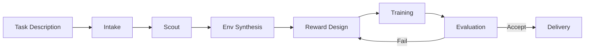

<p align="center">
  
</p>

# RoboSmith

**From robotics problem to working policy — with minimal friction.**

RoboSmith is a robotics toolchain built around two complementary workflows. The first takes a plain English task description and produces a trained RL policy through a fully autonomous pipeline. The second helps you work with the existing robotics ecosystem — inspecting policies, datasets, and environments, diagnosing rollouts, and generating the adapter code to bridge incompatible artifacts.

Both workflows are built on the same foundation: compiled LangGraph state machines where every step is an explicit node, failures are handled by conditional routing, and the full pipeline state is persisted to disk so nothing is ever lost.

---

## The two workflows

### Train from scratch

You describe what you want. RoboSmith handles everything else.

```bash
robosmith run --task "A Franka arm that picks up a red cube"
```

The pipeline runs through 7 stages — parsing your task, searching the literature for reward design insights, selecting the right simulation environment, evolving a reward function through LLM-powered search, training an RL policy, evaluating it behaviorally, and packaging the results. If evaluation fails, the pipeline analyzes what went wrong and iterates automatically.

### Integrate existing work

You have artifacts that don't fit together. RoboSmith helps you understand and bridge them.

```bash
robosmith inspect compat lerobot/smolvla_base lerobot/aloha_mobile_cabinet --fix
```

This workflow exists because not every robotics problem starts from scratch. Pre-trained policies, collected datasets, and existing environments are everywhere — but they rarely fit together out of the box. Different camera naming conventions, mismatched action dimensions, wrong image resolutions. The integration tooling gives you the primitives to understand and resolve these mismatches systematically.

---

## Why agentic architecture?

Both workflows run as LangGraph `StateGraph` instances. This is a deliberate architectural choice.

Every node has typed inputs and outputs. The full state — what each stage received, what it produced, what decision was made — is written to disk after every step. Failures are routed to recovery paths by conditional edges, not by unhandled exceptions. A reward function that crashes during evaluation gets an error score and the pipeline continues. A training run that stalls early triggers the decision agent rather than running to completion and wasting compute.

The auto-integrate workflow is built from the same inspection and generation building blocks as the standalone `inspect` and `gen` commands. Adding a new workflow means composing a new graph from existing nodes — the infrastructure is shared.

---

## Pipeline at a glance



| Stage | What it does | LLM? | Time |
|-------|-------------|------|------|
| **Intake** | Parses task → structured `TaskSpec` | Yes (fast) | ~1s |
| **Scout** | Searches Semantic Scholar / ArXiv for reward insights | No | 10–60s |
| **Env Synthesis** | Tag-matches task to best simulation environment | No | <1s |
| **Reward Design** | Evolves reward functions via LLM + rollout evaluation | Yes (main) | 30–120s |
| **Training** | Trains RL policy — algorithm and backend auto-selected | No | 1–10 min |
| **Evaluation** | Measures behavioral success, not just reward value | Yes (fast) | 10–30s |
| **Delivery** | Packages checkpoint, video, reward function, report | No | 5–15s |

---

## Integration tooling at a glance

| Command | What it tells you |
|---------|------------------|
| `robosmith inspect dataset <id>` | Cameras, action/state dims, episodes, storage format |
| `robosmith inspect env <id>` | Obs/action spaces, episode structure, per-dim docs |
| `robosmith inspect policy <id>` | Architecture, expected inputs/outputs, action head |
| `robosmith inspect robot <path>` | Joints, DOF, end effector from URDF or MJCF |
| `robosmith inspect compat <a> <b>` | All mismatches with severity and fix hints |
| `robosmith inspect compat ... --fix` | Generates `PolicyAdapter` to resolve mismatches |
| `robosmith diag trajectory <path>` | Success rate, action stats, failure clusters |
| `robosmith diag compare <a> <b>` | Side-by-side delta between two rollouts |
| `robosmith gen wrapper <policy> <target>` | Python adapter code (LLM or template-based) |
| `robosmith auto integrate <policy> <target>` | Full inspect → compat → generate pipeline |

---

## Quick links

- [Installation](getting-started/installation.md) — get RoboSmith running in minutes
- [Quick Start](getting-started/quickstart.md) — your first training run and first integration
- [Configuration](getting-started/configuration.md) — CLI flags, YAML config, and environment variables
- [Pipeline Overview](pipeline/overview.md) — how each stage works and why it exists
- [Scout](pipeline/scout.md) — literature search backends (Semantic Scholar, ArXiv, both)
- [Custom Trainers](extending/trainers.md) — add your own RL backend
- [Custom Environments](extending/environments.md) — add your own simulation framework
- [Contributing](contributing.md) — development setup and project structure
