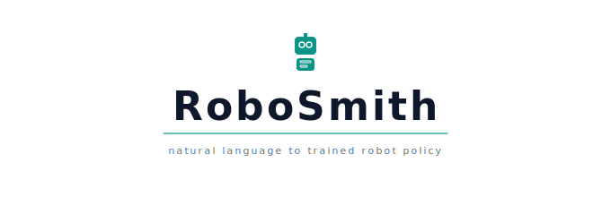
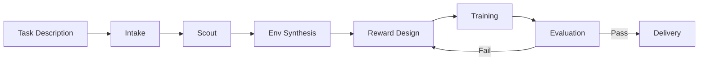

<p align="center">
  
</p>

# RoboSmith

**Natural language → trained robot policy.**

RoboSmith is an autonomous pipeline that takes a plain English task description and produces a trained reinforcement learning policy — handling environment selection, reward design, training, evaluation, and delivery with zero human intervention.

```bash
robosmith run --task "Walk forward" --time-budget 5
```

---

## Why RoboSmith exists

Training a robot policy today is a multistep, expert-driven process. You need to pick the right simulator, write a reward function (often the hardest part), choose an RL algorithm, tune hyperparameters, evaluate whether the policy actually does what you want, and iterate when it doesn't. Each of these steps requires specialized knowledge, and the whole process can take days or weeks of trial and error.

RoboSmith automates the entire workflow. You describe what you want in plain English, and it handles everything else — from finding the right simulation environment to delivering a trained policy checkpoint with a video of the robot performing the task.

The core insight is that large language models are remarkably good at writing reward functions when given proper context about the observation and action spaces. RoboSmith combines this capability with evolutionary search (inspired by [Eureka](https://eureka-research.github.io/)) and wraps it in a fully autonomous pipeline that can iterate on its own failures.

---

## Pipeline at a glance



| Stage | What it does | Uses LLM? | Typical time |
|-------|-------------|-----------|-------------|
| **Intake** | Parses natural language into a structured task spec | Yes (fast model) | ~1s |
| **Scout** | Searches Semantic Scholar for relevant research | No | 10–60s |
| **Env Synthesis** | Matches the task to the best simulation environment | No | <1s |
| **Reward Design** | Evolves reward functions using LLM + random rollouts | Yes (main model) | 30–120s |
| **Training** | Trains an RL policy with the best reward function | No | 1–10 min |
| **Evaluation** | Runs the policy and measures behavioral success | Yes (fast model) | 10–30s |
| **Delivery** | Packages checkpoint, video, report, and reward code | No | 5–15s |

---

## Features

- **7-stage autonomous pipeline** — from natural language to a trained policy checkpoint with no manual steps
- **Evolutionary reward design** — Eureka-style LLM-powered reward function evolution with multi-generation search
- **5 training backends** — SB3, CleanRL, rl_games, imitation learning, offline RL, each pluggable through a common interface
- **5 environment adapters** — Gymnasium/MuJoCo, Isaac Lab, LIBERO, ManiSkill, and custom MJCF/URDF, all discoverable at runtime
- **30 pre-registered environments** — locomotion, manipulation, classic control, dexterous hands, and more
- **Smart algorithm selection** — task-aware paradigm and algorithm choice based on robot type, action space, and available data
- **Behavioral success detection** — measures whether the robot actually did the task, not whether the reward value is high
- **Autonomous observation introspection** — 3-tier obs layout extraction (runtime, sample-based, LLM) with no hardcoded layouts
- **LLM decision agent** — intelligent iteration decisions with actionable suggestions when evaluation fails
- **Literature-informed reward design** — Scout stage feeds relevant paper abstracts into the reward generation prompt
- **Full artifact delivery** — checkpoint, evolved reward function, evaluation report, rollout video, and human-readable summary
- **Provider-agnostic LLM access** — Anthropic, OpenAI, Ollama, or any provider supported by LiteLLM

---

## Quick links

- [Installation](getting-started/installation.md) — get RoboSmith running in 2 minutes
- [Quick Start](getting-started/quickstart.md) — your first autonomous training run
- [Configuration](getting-started/configuration.md) — CLI flags, YAML config, and environment variables
- [Pipeline Overview](pipeline/overview.md) — how each stage works in detail
- [Custom Trainers](extending/trainers.md) — add your own RL backend
- [Custom Environments](extending/environments.md) — add your own simulation framework
- [Custom Agents](extending/agents.md) — extend or replace LLM agents
- [API Reference](api/config.md) — full API documentation for all modules
- [Contributing](contributing.md) — development setup, testing, and code style

---

## Who is this for?

**Robotics researchers** who want to quickly prototype policies for new tasks without spending days on reward engineering.

**RL practitioners** who want a batteries-included pipeline that handles the tedious parts (env setup, obs introspection, evaluation criteria) so they can focus on the research.

**Engineers** who need to train robot policies but don't have deep RL expertise — RoboSmith makes the right algorithmic choices automatically.

**Educators** who want to demonstrate the full RL pipeline without requiring students to set up complex toolchains.
