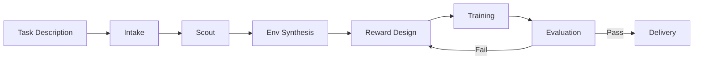

# RoboSmith

**Natural language → trained robot policy.**

RoboSmith is an autonomous pipeline that takes a plain English task description and produces a trained RL policy — handling environment selection, reward design, training, evaluation, and delivery with zero human intervention.

```bash
robosmith run --task "Walk forward" --time-budget 5
```

## Pipeline at a Glance



## Features

- **7-stage autonomous pipeline** — intake, literature search, env selection, reward design, training, evaluation, delivery
- **Evolutionary reward design** — Eureka-style LLM-powered reward function evolution
- **5 training backends** — SB3, CleanRL, rl_games, imitation learning, offline RL
- **5 environment adapters** — Gymnasium, Isaac Lab, LIBERO, ManiSkill, custom MJCF/URDF
- **Smart algorithm selection** — task-aware paradigm and algorithm choice
- **Behavioral success detection** — measures task completion, not reward values
- **Autonomous observation introspection** — 3-tier obs layout extraction, no hardcoding
- **LLM decision agent** — intelligent iteration decisions with actionable suggestions

## Quick Links

- [Installation](getting-started/installation.md) — Get RoboSmith running in 2 minutes
- [Quick Start](getting-started/quickstart.md) — Your first autonomous training run
- [Pipeline Overview](pipeline/overview.md) — How each stage works
- [Custom Trainers](extending/trainers.md) — Add your own RL backend
- [Custom Environments](extending/environments.md) — Add your own simulation framework
