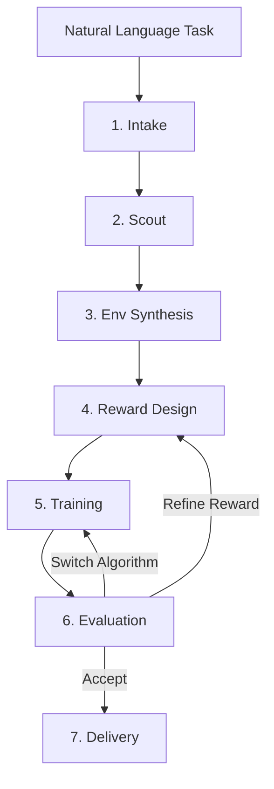

# Pipeline Overview

The training pipeline is built as a compiled LangGraph `StateGraph`. Each of the 7 stages is a node with typed inputs and outputs. Conditional edges handle two things that a linear script can't: failure recovery within a stage, and the reward-refinement retry loop between stages.

The pipeline is not a sequential script that runs start to finish and either succeeds or crashes. It's a graph that adapts. When evaluation fails, the graph routes back to reward design with a plain-English analysis of what went wrong — not a blank restart. When a stage encounters an error, the graph routes to a recovery path. The full `PipelineState` is written to disk after every node, so you can inspect exactly what happened at each step.



---

## Stage summary

| Stage | Input | Output | LLM? | Time |
|-------|-------|--------|------|------|
| **Intake** | `"Walk forward"` | `TaskSpec` — robot type, env type, algorithm, criteria | Yes (fast) | ~1s |
| **Scout** | `TaskSpec` | `KnowledgeCard` — ranked paper abstracts | No | 10–60s |
| **Env Synthesis** | `TaskSpec` | `EnvEntry` — best matching environment | No | <1s |
| **Reward Design** | `EnvEntry` + papers | `RewardCandidate` — evolved reward function | Yes (main) | 30–120s |
| **Training** | Reward + env | Policy checkpoint (`.zip` or `.pt`) | No | 1–10 min |
| **Evaluation** | Policy + env | `EvalReport` — success rate, decision | Yes (fast) | 10–30s |
| **Delivery** | All artifacts | Report, video, `reward_function.py` | No | 5–15s |

---

## How the stages connect

Data flows through a shared `PipelineState` TypedDict. Every node reads the fields it needs from the state and writes its results back. The state is persisted to `run_state.json` after every node, so a failed run can be inspected at any point.

```
TaskSpec ──────────────────────────────────────────────── Delivery
    │                                                         ▲
    ▼                                                         │
KnowledgeCard ──▶ Reward Design (literature context)         │
    │                                                         │
    ▼                                                         │
EnvEntry ──▶ make_env() ─┬──▶ Reward evaluation              │
                         ├──▶ Training                        │
                         └──▶ Evaluation                      │
                                   │                          │
RewardCandidate ──▶ Training ──▶ Policy ──▶ Evaluation ───────┘
```

---

## The iteration loop

After evaluation, the pipeline makes a decision. This happens in two steps.

**Step 1 — Rule-based.** The evaluator checks whether the task's success criteria were met (default: `success_rate >= 0.8`). If they pass, the decision is `ACCEPT`. If they fail, it looks at the failure pattern:

| Failure pattern | Decision | What happens next |
|----------------|----------|------------------|
| All criteria pass | `ACCEPT` | Proceed to delivery |
| Partial success (`success_rate > 0.5`) | `REFINE_REWARD` | Return to reward design with feedback |
| Catastrophic failure (reward ≤ 0, episodes < 20 steps) | `SWITCH_ALGO` | Try a different RL algorithm |
| Default | `REFINE_REWARD` | Return to reward design with feedback |

**Step 2 — LLM second opinion.** When the rule-based decision is not `ACCEPT`, the `DecisionAgent` analyzes the evaluation report, training curve, and reward function code. If its confidence is ≥ 0.6, its decision overrides the rule-based one.

This matters because rules are blunt. The LLM agent can recognize that training was still improving at the time limit and recommend running longer rather than redesigning the reward. Or that the reward function is fundamentally sound but the penalty terms are too aggressive for early exploration. The rules would call both cases `REFINE_REWARD`; the agent can distinguish them.

Up to 3 iterations are allowed by default (`max_iterations` in config).

---

## Training reflection

Between iterations, the controller generates a training reflection — a plain-English summary of what happened during training. This is injected directly into the reward design prompt on the next iteration, giving the LLM concrete feedback rather than a blank start.

Example reflections:

> "Training reward was flat at 10.83 for 8 consecutive checkpoints. The reward function is not providing a useful gradient — consider adding velocity or progress terms."

> "Reward increased from −200 to +50 over training but plateaued in the last 20% of steps. The forward velocity coefficient may need to be increased."

> "Training diverged after 20K steps — reward collapsed from +100 to −500. The action penalty term may be too aggressive."

The reward design LLM uses this to make targeted changes to the reward function rather than generating something entirely different.

---

## Stage skipping

Some stages can be skipped for faster iteration:

```bash
# Skip literature search — saves 10–60 seconds, useful when iterating on a known task
robosmith run --task "Walk forward" --skip scout

# Skip delivery — useful when you only care about the training result
robosmith run --task "Walk forward" --skip delivery
```

Skipped stages are recorded as `SKIPPED` in the run state, so the final report is always accurate about what ran.

## Dry run

Dry run mode runs intake and env synthesis only — it parses the task, selects an environment, and shows you what algorithm would be used. Nothing is trained.

```bash
robosmith run --task "Walk forward" --dry-run
```

Use this to verify that your task description is being interpreted correctly before committing compute.

---

## Per-stage documentation

Each stage has its own detailed documentation:

- [Intake](intake.md) — natural language parsing and `TaskSpec` structure
- [Scout](scout.md) — literature search backends and `KnowledgeCard`
- [Env Synthesis](env-synthesis.md) — environment matching and the registry
- [Reward Design](reward-design.md) — the evolution loop, obs introspection, candidate evaluation
- [Training](training.md) — backend selection, reward injection, stall detection
- [Evaluation](evaluation.md) — behavioral success detection and the decision agent
- [Delivery](delivery.md) — artifact packaging and the run report
