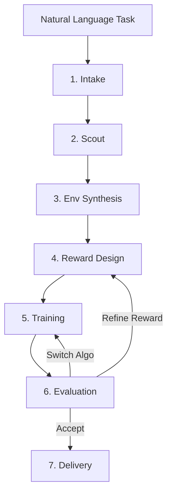

# Pipeline Overview

RoboSmith's pipeline has 7 stages that run sequentially, with an optional feedback loop for iteration when evaluation fails.



## How the stages connect

The pipeline is orchestrated by `ForgeController`, which walks through stages in order, tracks state, and decides whether to loop. Each stage is a separate module with a clean interface — the controller calls them and manages data flow between them.

Every stage reads from a shared `RunState` object and writes its results back. The state is persisted to `run_state.json` after every stage, so you can inspect exactly what happened at each step and reproduce any run.

## Stage summary

| Stage | Input | Output | LLM? | Time |
|-------|-------|--------|------|------|
| **Intake** | `"Walk forward"` | `TaskSpec` (robot type, env type, criteria) | Yes (fast) | ~1s |
| **Scout** | `TaskSpec` | `KnowledgeCard` (relevant papers) | No | 10–60s |
| **Env Synthesis** | `TaskSpec` | `EnvEntry` (best matching environment) | No | <1s |
| **Reward Design** | `EnvEntry` + papers | `RewardCandidate` (evolved reward fn) | Yes (main) | 30–120s |
| **Training** | Reward + Env | Policy checkpoint (`.zip` / `.pt`) | No | 1–10 min |
| **Evaluation** | Policy + Env | `EvalReport` (success rate, decision) | Yes (fast) | 10–30s |
| **Delivery** | All artifacts | Report, video, `reward_function.py` | No | 5–15s |

## Iteration logic

After evaluation, the pipeline makes a decision about what to do next. This decision is made in two steps:

**Step 1 — Rule-based evaluation.** The evaluator checks success criteria (default: `success_rate >= 0.8`) against the evaluation report. If all criteria pass, the decision is `ACCEPT`. Otherwise, it looks at the failure mode: very low performance (mean reward ≤ 0, episodes shorter than 20 steps) suggests the algorithm itself isn't working (`SWITCH_ALGO`), while partial success suggests the reward function needs refinement (`REFINE_REWARD`).

**Step 2 — LLM second opinion.** When the rule-based decision is not `ACCEPT`, the `DecisionAgent` analyzes the evaluation report, training curve, and reward function code. It provides a decision with a confidence score and actionable suggestions. If confidence is ≥ 0.6, its decision overrides the rule-based one. This catches cases where the rules would do the wrong thing — for example, when training was still improving at the time limit and just needs more steps, not a different reward.

The three possible decisions are:

- **Accept** — success criteria met, proceed to delivery
- **Refine reward** — go back to reward design with feedback about what went wrong
- **Switch algorithm** — try a different RL algorithm (e.g., SAC instead of PPO)

Up to 3 iterations are allowed by default (configurable via `max_iterations`).

## Data flow

```
TaskSpec ──────────────────────────────────────────────────▶ Delivery
    │                                                           ▲
    ▼                                                           │
KnowledgeCard ──▶ RewardAgent (context for reward generation)   │
    │                                                           │
    ▼                                                           │
EnvEntry ──────▶ make_env() ─┬──▶ Reward evaluation             │
    │                        ├──▶ Training                      │
    │                        └──▶ Evaluation                    │
    ▼                                                           │
RewardCandidate ──▶ Training ──▶ Policy ──▶ Evaluation ────────┘
```

## Training reflection

Between iterations, the controller analyzes the training curve from the previous attempt and produces a text reflection. This reflection is a plain-English summary of what happened during training — for example, "Reward was flat at 10.83 for 8 checkpoints, suggesting the reward function doesn't provide a useful gradient" or "Reward increased steadily from -200 to 50 but plateaued in the last 20% of training."

This reflection is fed directly into the reward design LLM prompt in the next iteration, giving it concrete feedback about why the previous attempt failed. The LLM uses this to make targeted improvements to the reward function rather than generating something entirely new.

## Critical failure detection

The controller monitors for situations where continued iteration would be pointless:

- If training crashes with an unrecoverable error (environment segfault, out of memory), the pipeline stops immediately
- If the same failure mode repeats across iterations (e.g., reward function errors out every time), the controller recognizes the pattern and stops
- If the pipeline has exhausted all algorithm alternatives, it stops and delivers whatever artifacts it has

In all cases, the delivery stage still runs — even a failed run produces a report explaining what happened and why.

## Skipping stages

You can skip stages that aren't needed for your workflow:

```bash
robosmith run --task "Walk forward" --skip scout
```

Common reasons to skip stages:

- **Skip scout** — if you don't need literature search (saves 10–60 seconds)
- **Skip intake** — if you're providing a fully specified `TaskSpec` via config

Skipped stages are recorded as `SKIPPED` in the run state.

## Dry run mode

Use `--dry-run` to parse the task and plan the pipeline without actually running training:

```bash
robosmith run --task "Walk forward" --dry-run
```

This runs intake and env synthesis only, showing you what environment would be selected and what algorithm would be used, without spending compute on training.
