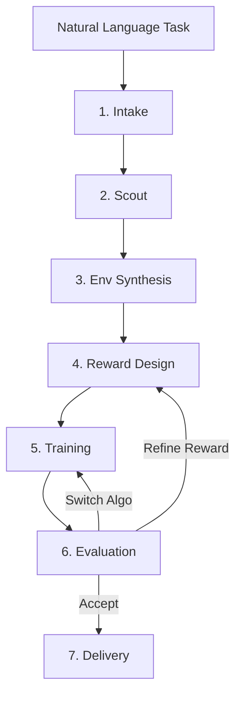

# Pipeline Overview

RoboSmith's pipeline has 7 stages that run sequentially, with an optional feedback loop for iteration.



## Stage Summary

| Stage | Input | Output | LLM? | Time |
|-------|-------|--------|------|------|
| **Intake** | "Walk forward" | TaskSpec (robot type, env type, criteria) | ✓ fast | ~1s |
| **Scout** | TaskSpec | KnowledgeCard (relevant papers) | ✗ | 10-60s |
| **Env Synthesis** | TaskSpec | EnvEntry (best matching environment) | ✗ | <1s |
| **Reward Design** | EnvEntry + papers | RewardCandidate (evolved reward fn) | ✓ main | 30-120s |
| **Training** | Reward + Env | Policy checkpoint (.zip/.pt) | ✗ | 1-10 min |
| **Evaluation** | Policy + Env | EvalReport (success rate, decision) | ✓ fast | 10-30s |
| **Delivery** | All artifacts | Report, video, reward_function.py | ✗ | 5-15s |

## Iteration Logic

After evaluation, the pipeline makes a decision:

- **Accept** — success criteria met, ship it
- **Refine reward** — reward function needs improvement, go back to stage 4
- **Switch algorithm** — RL algorithm isn't working, try a different one at stage 5

The decision is made by a rule-based evaluator with an LLM second opinion for uncertain cases. Up to 3 iterations are allowed by default.

## Data Flow

```
TaskSpec ──────────────────────────────────────────────────▶ Delivery
    │                                                           ▲
    ▼                                                           │
KnowledgeCard ──▶ RewardAgent (context for reward generation)   │
    │                                                           │
    ▼                                                           │
EnvEntry ──────▶ make_env() ─┬──▶ Reward evaluation             │
    │                        ├──▶ Training                      │
    │                        └──▶ Evaluation                    │
    ▼                                                           │
RewardCandidate ──▶ Training ──▶ Policy ──▶ Evaluation ────────┘
```

Each stage writes its results to `RunState`, which is persisted to `run_state.json` for debugging and reproducibility.
